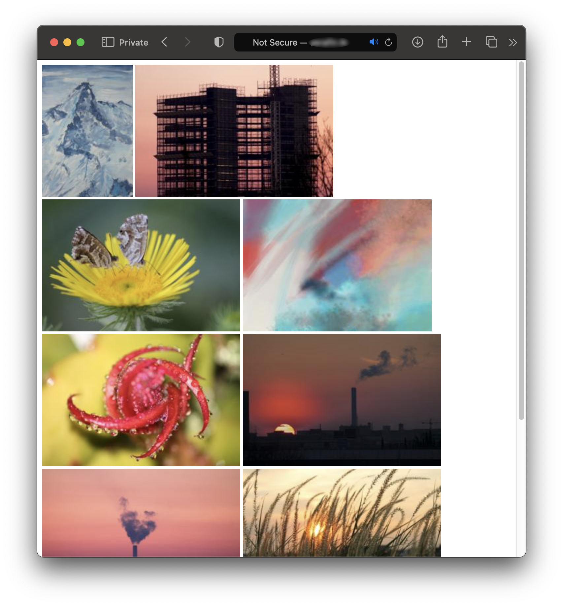

# Thumbnail-Gallery-PHP
Generate a thumbnail gallery from images in a specified directory using PHP. Supports JPEG, PNG, GIF, and WebP formats. Responsive grid layout with FancyBox lightbox for image viewing. Easily customize thumbnail height and add images to the "gallery" folder for automatic inclusion. Ideal for creating efficient thumbnail galleries in web projects.

## Features

- Create thumbnails for JPEG, PNG, GIF, and WebP images.
- Responsive grid layout for the thumbnail gallery.
- Integrated lightbox with FancyBox for viewing original images.
- Customize thumbnail height easily.
- Simple setup - just add images to the "gallery" folder.

## Requirements

- PHP 5.6 or higher.
- Web server environment with **GD** extension enabled.

## Usage

1. Place your images in the "gallery" directory.
2. Open the PHP script to view the thumbnail gallery.

## Screenshot

## License

This project is licensed under the [MIT License](LICENSE).
